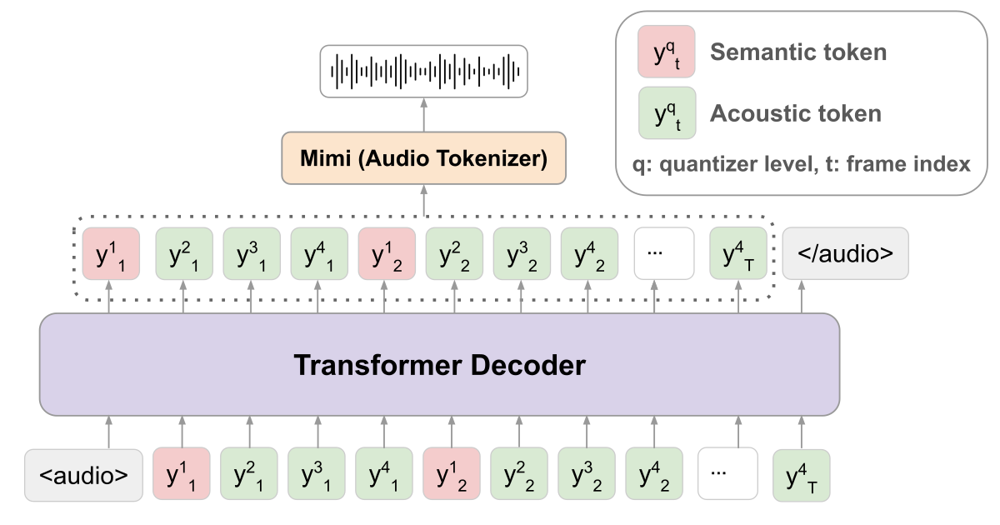

<div align="center">

# Llama-Mimi
#### Autoregressive Speech Language Modeling with Interleaved Semantic and Acoustic Tokens
[📃Paper](https://arxiv.org/abs/2509.14882) | [🤗Model](https://huggingface.co/llm-jp/Llama-Mimi-1.3B) | [🗣️Demo](https://speed1313.github.io/llama-mimi/)



</div>


## Introduction
Llama-Mimi is a speech language model that uses a unified tokenizer (Mimi) and a single Transformer decoder (Llama) to jointly model sequences of interleaved semantic and acoustic tokens.
Trained on ~240k hours of English audio, Llama-Mimi achieves state-of-the-art performance in acoustic consistency on [SALMon](https://arxiv.org/abs/2409.07437) and effectively preserves speaker identity.
Visit our [demo site](https://speed1313.github.io/llama-mimi/) to hear generated speech samples.


## Setup
Install dependencies:
```bash
uv sync
```

## Generate Speech

Generate audio continuations from a given audio prompt.
```bash
uv run python inference.py
```

An example output:

<audio controls>
  <source src="assets/output.wav" type="audio/wav">
</audio>

## Train Llama-Mimi

To train the model on the LibriSpeech dataset, run:
```bash
bash train.sh
```
To use a custom dataset, update the configuration in `torchtitan/datasets/hf_dataset.py`.


After training, convert dcp checkpoint to HuggingFace format to infer with the model:
```bash
uv run python scripts/convert_dcp_to_hf.py
```


## Evaluation
Evaluate the model on various benchmarks:
```bash
uv run python eval/salmon.py --model_name llm-jp/Llama-Mimi-1.3B
uv run python eval/sStoryCloze.py --model_name llm-jp/Llama-Mimi-1.3B
uv run python eval/sLM21.py --model_name llm-jp/Llama-Mimi-1.3B
```


## Acknowledge
This code is built on top of [TorchTitan](https://github.com/pytorch/torchtitan).


## Citation
```
@misc{sugiura2025llamamimispeechlanguagemodels,
      title={Llama-Mimi: Speech Language Models with Interleaved Semantic and Acoustic Tokens},
      author={Issa Sugiura and Shuhei Kurita and Yusuke Oda and Ryuichiro Higashinaka},
      year={2025},
      eprint={2509.14882},
      archivePrefix={arXiv},
      primaryClass={cs.CL},
      url={https://arxiv.org/abs/2509.14882},
}
```
