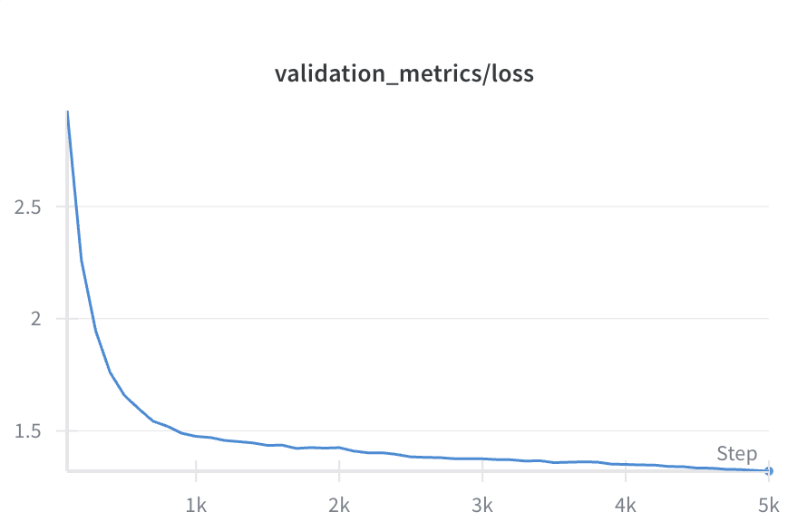

<div align="center">

# Llama-Mimi
#### Autoregressive Speech Language Modeling with Interleaved Semantic and Acoustic Tokens
| [📃Paper](https://arxiv.org/abs/2509.14882) | [🤗Models](https://huggingface.co/llm-jp/Llama-Mimi-1.3B) | [🗣️Online Demo](https://speed1313.github.io/llama-mimi/)


</div>


## Introduction
Llama-Mimi is a speech language model that uses a unified tokenizer (Mimi) and a single Transformer decoder (Llama) to jointly model sequences of interleaved semantic and acoustic tokens.
Trained on ~240k hours of English audio, Llama-Mimi achieves state-of-the-art performance in acoustic consistency on [SALMon](https://arxiv.org/abs/2409.07437) and effectively preserves speaker identity.

Visit our [demo site](https://speed1313.github.io/llama-mimi/) to hear generated speech samples.


## Repository Overview
This repository lets you:
- Run inference with our pretrained models
- Pre-train Llama-Mimi on [The People's Speech](https://huggingface.co/datasets/MLCommons/peoples_speech)
- Evaluate the model on multiple benchmarks

## Setup


Install dependencies using uv:
```bash
uv sync
```

## Generate Speech

Generate audio continuations from a given audio prompt using our pretrained model (Llama-Mimi-1.3B):
```bash
uv run python inference.py
```

[▶️ Listen to samples on our demo site](https://speed1313.github.io/llama-mimi)

## Pre-train Llama-Mimi on The People's Speech

To pre-train Llama-Mimi on [The People's Speech](https://huggingface.co/datasets/MLCommons/peoples_speech) (30k hours), first download the dataset locally:
```bash
uv run huggingface-cli download  MLCommons/peoples_speech  --repo-type dataset --local-dir data/peoples_speech
```

Then launch training with:
```bash
torchrun --nproc_per_node=8 --local-ranks-filter 0 \
      --role rank --tee 3 -m torchtitan.train \
      --job.config_file config/llama3_2_1b_peoples_speech.toml
```
This config trains Llama-Mimi-1.3B for 5,000 steps with a global batch size of 1,024 on 8 GPUs.
Training progress can be monitored with Weights & Biases (W&B).

<div align="center">

</div>

To use a custom dataset, update the configuration in `torchtitan/datasets/hf_dataset.py`. We recommend downloading multiple large datasets, shuffling them, and then using `load_dataset()` with local files.

After training, convert dcp checkpoint to HuggingFace format to use the model with `transformers` library:

```bash
uv run python scripts/convert_dcp_to_hf.py
```


## Evaluation
Evaluate models on [SALMon](https://github.com/slp-rl/salmon), [sLM21](https://arxiv.org/abs/2104.14700) (sWUGGY and sBLIMP), and [sStoryCloze](https://github.com/slp-rl/SpokenStoryCloze) tasks.

SALMon:
```bash
uv run python eval/salmon.py --model_name llm-jp/Llama-Mimi-1.3B
```

sStoryCloze:
```bash
uv run python eval/sStoryCloze.py --model_name llm-jp/Llama-Mimi-1.3B
```

sLM21:
```bash
uv run python eval/sLM21.py --model_name llm-jp/Llama-Mimi-1.3B
```


## Acknowledge

- Our training code is built on top of [TorchTitan](https://github.com/pytorch/torchtitan).

- Our model employs [Llama 3](https://arxiv.org/abs/2407.21783) as the base language model, and [Mimi](https://arxiv.org/abs/2410.00037) as the audio tokenizer.


## Citation
Star us on GitHub if you find this repository useful! ⭐

If you find this work interesting, please cite our paper:
```
@misc{sugiura2025llamamimispeechlanguagemodels,
      title={Llama-Mimi: Speech Language Models with Interleaved Semantic and Acoustic Tokens},
      author={Issa Sugiura and Shuhei Kurita and Yusuke Oda and Ryuichiro Higashinaka},
      year={2025},
      eprint={2509.14882},
      archivePrefix={arXiv},
      primaryClass={cs.CL},
      url={https://arxiv.org/abs/2509.14882},
}
```

